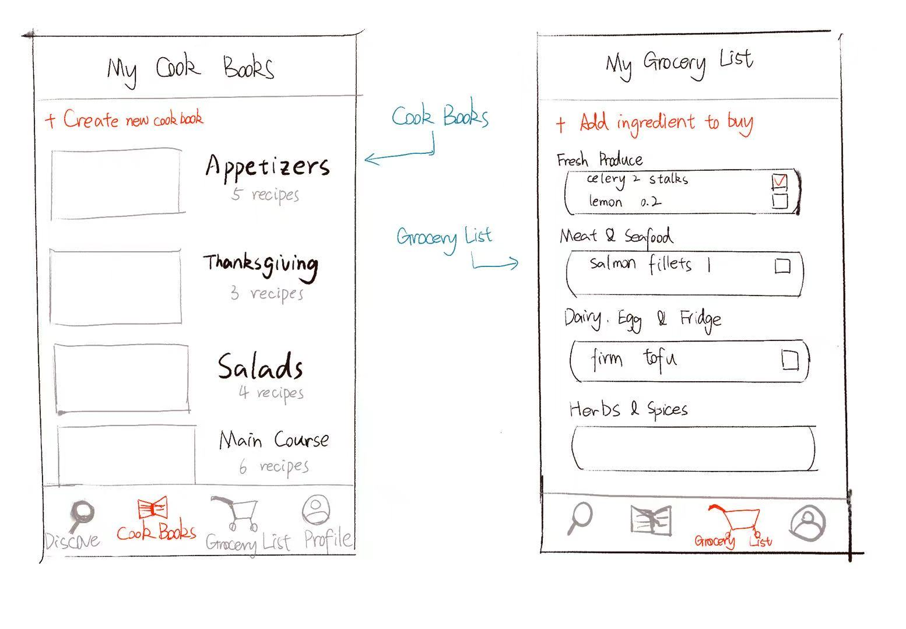
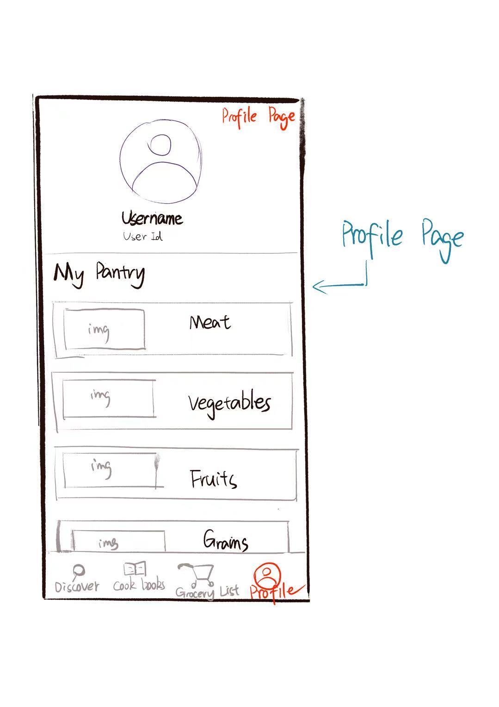

# CS 501 Final Project: Pantry Pal - Smart Recipe Discovery

## Objective (CS 501 - Spring 2025)

This project fulfills the requirements for CS 501 - Mobile Application Development. The primary goal is to develop a feature-rich, user-friendly Android application that integrates modern mobile development principles, focusing on creating an engaging, polished, and delightful app that serves as an impressive portfolio piece.

## Overview: Pantry Pal

Pantry Pal is a user-centric recipe discovery app designed to minimize food waste and simplify meal planning by leveraging ingredients users already have. Targeting cooking enthusiasts and beginners alike, the app combines practicality with playful interaction, empowering users to cook creatively while reducing unnecessary grocery purchases.

## Target Users & Goals

*   **Target Users:**
    *   Cooking beginners and enthusiasts seeking new dishes or ways to use existing ingredients.
    *   Environmentally conscious individuals aiming to reduce food waste.
*   **Project Goals:**
    *   Provide personalized recipe recommendations based on available ingredients.
    *   Enhance user engagement through interactive features like the "shake-shake" function.
    *   Offer convenient recipe storage and offline access.
    *   Help users manage kitchen inventory and create shopping lists, improving meal planning efficiency.

## Core Features (Aligned with CS 501 Requirements)

1.  **Local Database for Data Persistence:**
    *   **Functionality:** Stores saved favorite recipes (Personal Cookbook) and user's pantry inventory locally.
    *   **Operations:** Supports CRUD (Create, Read, Update, Delete) operations for managing recipes and pantry items.
    *   **Benefit:** Enables offline access and quick retrieval of user data.

2.  **External API Integration:**
    *   **API Used:** [Edamam Recipe API](https://developer.edamam.com/edamam-recipe-api)
    *   **Functionality:** Fetches recipes based on user-inputted ingredients.
    *   **Benefit:** Provides a vast library of recipes tailored to the user's available items.

3.  **Onboard Sensor Integration:**
    *   **Accelerometer:** Powers the "Shake for Surprise" feature, offering a random recipe suggestion when the user shakes their phone, adding an element of fun.
    *   **Microphone:** Enables voice input for searching recipes or ingredients hands-free.
    *   **(Potential Feature) Camera:** Scan ingredients using the camera to automatically update the pantry inventory via text recognition (OCR).

4.  **Multi-Device Support & Optimization:**
    *   **Tested Devices:** Designed and tested for compatibility on both standard Android smartphones and tablets.
    *   **Responsive UI:** Utilizes Jetpack Compose's responsive design principles to adapt the layout dynamically. Phones display a compact view, while tablets offer an expanded multi-pane UI for enhanced usability.

5.  **Clean, Usable, and Delightful UI/UX (with Accessibility):**
    *   **UI Toolkit:** Built entirely with Jetpack Compose.
    *   **Design:** Follows Material Design guidelines for consistency, providing smooth interactions, fluid animations (e.g., screen transitions), and intuitive navigation.
    *   **Accessibility:** Adheres to accessibility best practices, including:
        *   Support for screen readers.
        *   Adequate color contrast and readable typography.
        *   Text scaling compatibility.
        *   Dark mode support.
        *   Alternative input methods (voice search).

## Technology Stack

*   **Language:** Kotlin
*   **UI Toolkit:** Jetpack Compose
*   **Architecture:** (Specify your architecture, e.g., MVVM, MVI)
*   **Asynchronous Programming:** Kotlin Coroutines
*   **Database:** (Specify: Room, Firebase Realtime/Firestore, DataStore)
*   **Networking:** Retrofit / OkHttp (for Edamam API)
*   **Dependency Injection:** (Specify if used, e.g., Hilt, Koin)
*   **Design:** Material Design 3

## Setup and Installation

1.  Clone the repository: `git clone https://github.com/your-username/CS501-Final-Project.git`
2.  Open the project in Android Studio (latest stable version recommended).
3.  Ensure you have the necessary Android SDK platforms installed.
4.  **(Add specific setup steps, e.g., API keys)** If the Edamam API requires an API key, create a `local.properties` file in the project root and add your key:
    ```properties
    EDAMAM_APP_ID="YOUR_APP_ID"
    EDAMAM_APP_KEY="YOUR_APP_KEY"
    ```
5.  Build the project: `Build > Make Project` or use the Gradle build button.
6.  Run the app on an emulator or physical device: `Run > Run 'app'`.

## Usage

*(Provide brief instructions or a walkthrough on how to use the main features of the app)*

1.  Launch Pantry Pal.
2.  Navigate to the 'Pantry' tab to add ingredients you have.
3.  Go to the 'Search' tab and input ingredients or use the 'Shake for Surprise' feature.
4.  Browse the suggested recipes.
5.  View recipe details and save favorites to your 'Cookbook'.
6.  Use the 'Grocery List' feature generated from missing ingredients in recipes.

## Project Milestones (CS 501 Structure)

This project followed an agile development approach with iterative sprints:

*   **Proposal:** Initial concept, tech stack selection, wireframes.
*   **Sprint 1:** Database implementation, initial UI setup, basic data persistence.
*   **Sprint 2:** External API integration, multi-device UI adaptation.
*   **Sprint 3:** Sensor integration, final UI polishing, beta testing.
*   **Final Submission:** Fully functional app, presentation, final report.

## Initial Sketches

*   Recipe Search and Detail Page:
    
*   Cook Books and Grocery List Page:
    
*   User Profile Page:
    


